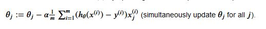
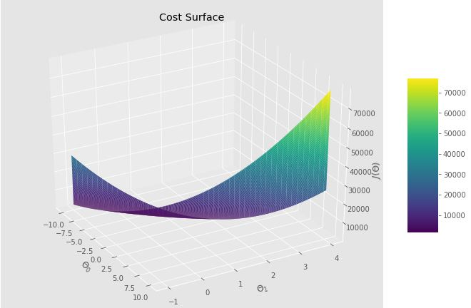

# RLineal
Este repositorio espera mostrar como construir un modelo predictivo con numpy y otras herramientas para la elaborar una regresión lineal de una variable.

# Librerias

``` python 
import numpy as np
import pandas as pd
import matplotlib.pyplot as plt
import seaborn as sns
```


# Preprocesing
```python
df  = pd.read_txt(data)
df.head() 
```


Ahora podemos revisar algunas métricas con 

```python
df.info()
df.describe()
```


``` python 
ax = sns.scatterplot(x='Population', y='Profit', data = df)
ax.set_title('Profit vs Population')
```

Este es el diagrama de dispersión

 

Ahora calculemos la funcíon de pérdida  para iniciar nuestra regresión


```python
df cost_function(X, y, theta)
    m = len(y)
    y_pred = X.dot(theta)
    error = (y_pred - y) ** 2
    return 1 /  (2 * m) * np.sum(error)
```
Puedes ver como ajusto los valores de la función en el código del repositorio

```python
#Este resultado es aleatorio puedes iterar varias veces, en los ajustes de las variables genero un theta o peso para cada variable de manera aletoria.
cost_function(X, y, theta)
13.87542580835085
```
Sin bien hemos calculado la pérdida no es un valor del todo efectivo, podemos optimizarlo aún más con una función gradient descent.



esto en python puede ser escrito de esta manera
```python 
def gradient_descent(X, y, theta, alpha, iterations):
    m = len(y)
    costs = []
    for i in range (iterations):
        y_pred = X.dot(theta)
        error = np.dot(X.transpose(), (y_pred - y))
        theta -= alpha * 1/m * error
        costs.append(cost_function(X, y, theta))

    return theta, costs 
``` 

Una vez construida la función podemos ver su comportamiento, lo ideal es iterar sobre distintos alphas para ver como converge la función
```python
theta, costs = gradient_descent (X, y, tetha, alpha= 0.01, iterations =1000)
```

# Visualizacón

```python
from mpl_toolkits.mplot3d import Axes3D
```

```python 
theta_0 = np.linspace(-10,10,100)
theta_1 = np.linspace(-1, 4, 100)

cost_value = np.zeros((len(theta_0), len(theta_1)))

for i in range(len(theta_0)):
    for j in range(len(theta_1)):
        t = np.array([theta_0[i], theta_1[j]])
        cost_values[i, j ] = cost_function(X, y, t)
```

```python 
fig = plt.figure(figsize = (12, 8))
ax = fig.gca(projection = '3d')

surf = ax.plot_surface(theta_0, theta_1, cost_values, cmap  = 'viridis', linewidth = 0.2)
fig.colorbar(surf, shrink=0.5, aspect=5)

plt.xlabel('\Theta_0')
plt.ylabel('\Theta_1')
ax.set_zlabel("$J(\Theta)$")
ax.set_title("Cost Surface")
ax.view_init(30,330)

plt.show()
```




