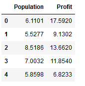
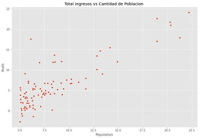

# RLineal
Este repositorio espera mostrar como construir un modelo predictivo con numpy y otras herramientas para la elaborar una regresión lineal de una variable.

# Librerias

``` python 
import numpy as np
import pandas as pd
import matplotlib.pyplot as plt
import seaborn as sns
```


# Preprocesing
```python
df  = pd.read_txt(data)
df.head() 
```


Ahora podemos revisar algunas métricas con 

```python
df.info()
df.describe()
```


``` python 
ax = sns.scatterplot(x='Population', y='Profit', data = df)
ax.set_title('Profit vs Population')




